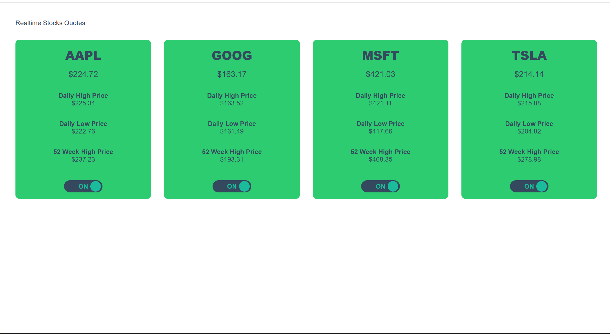

# angular-realtime-stocks-quotes

An Angular project that communicate with a NodeJs server to show realtime stocks quotes through a Websocket.
The Node.js server connect to the Yahoo API to retrieve some stocks quotes (can be easily changed in the app.component.ts of the Angular project)

To use the Yahoo API is important to update API_KEY in the ws.ts file.

This project was generated with [Angular CLI](https://github.com/angular/angular-cli) version 18.

## Development server

Run `ng serve` for a dev server. Navigate to `http://localhost:4200/`. The app will automatically reload if you change any of the source files.

## Code scaffolding

Run `ng generate component component-name` to generate a new component. You can also use `ng generate directive|pipe|service|class|guard|interface|enum|module`.

## Build

Run `ng build` to build the project. The build artifacts will be stored in the `dist/` directory. Use the `--prod` flag for a production build.

## Running unit tests

Run `ng test` to execute the unit tests via [Karma](https://karma-runner.github.io).

## Further help

To get more help on the Angular CLI use `ng help` or go check out the [Angular CLI Overview and Command Reference](https://angular.io/cli) page.

